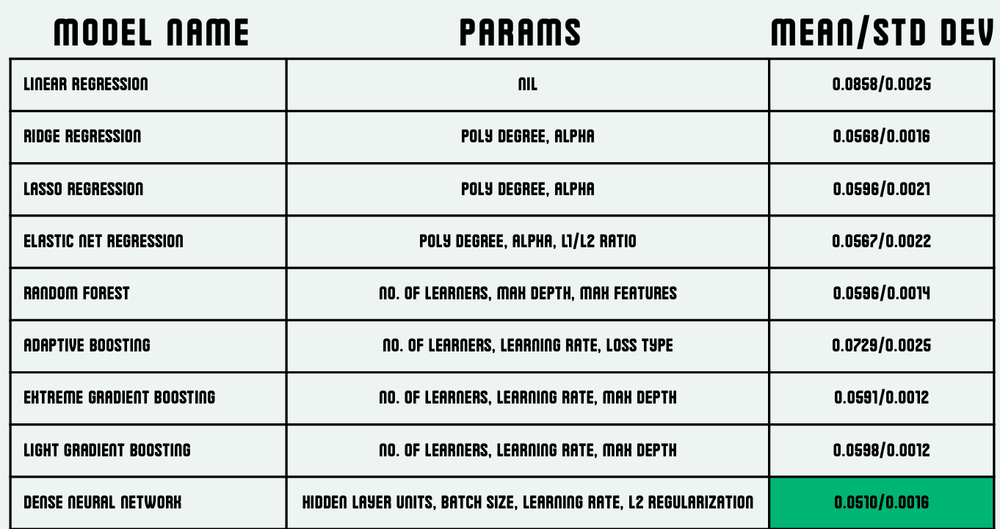
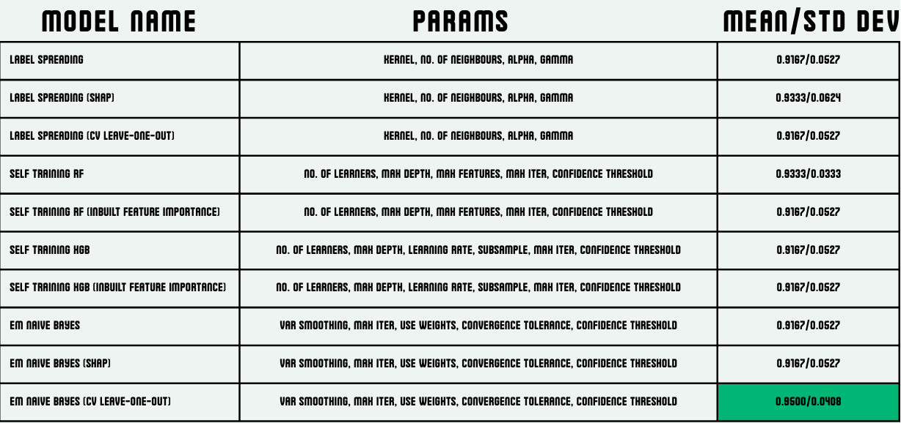
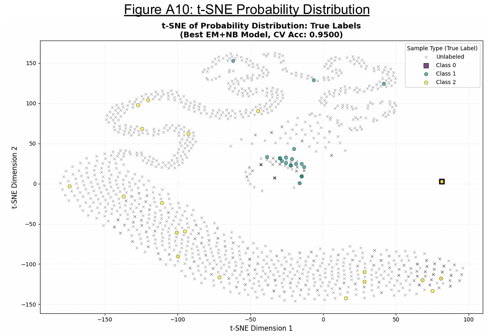
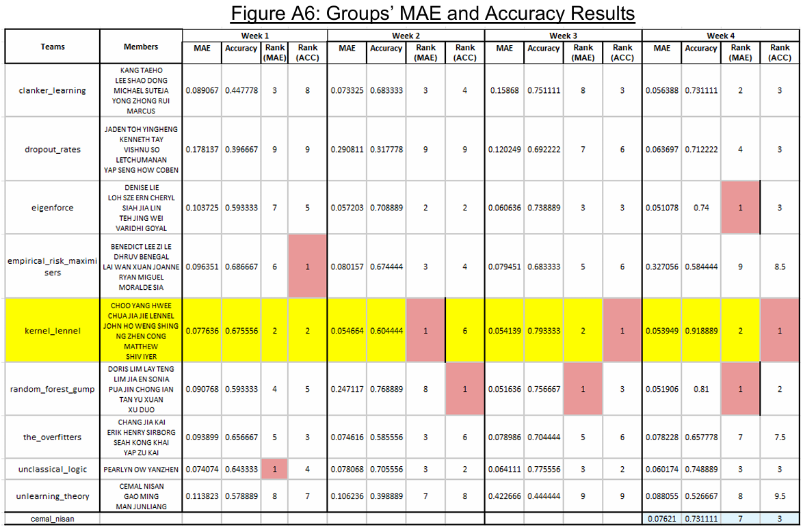

# Noise and Anomaly Detection in Recommender System Data
**CS421 – Principles of Machine Learning (Group Project)**

## Overview

This project investigates **noise and anomaly detection in recommender system datasets** using user–item interaction data with ratings. Rather than building a recommender model, the goal is to **identify and quantify noise intentionally injected into each user’s interaction history**.

Each user’s data is corrupted using a hidden anomaly generation procedure defined by:
- a **continuous noise level** \(`p ∈ [0,1]`\), and
- a **discrete anomaly type** \(`X ∈ {0,1,2}`\).

The task is to infer both quantities from observed user–movie rating interactions.

---
## Report Summary
### Anomaly Level Prediction (Regression):
- extensive **feature engineering** was performed to transform sparse user–item interactions into user-level representations, including rating statistics, global/item-based deviations, and duplicate-based features. 
- Multiple linear, ensemble, and neural models were evaluated. A **Dense Neural Network with regularization** achieved the best performance, demonstrating strong generalization and low mean absolute error on unseen data.
  
### Anomaly Type Prediction (classification):
- the task was treated as **semi-supervised** learning due to the limited availability of class labels
- An **Expectation–Maximization Naive Bayes model** performed best, achieving high classification accuracy while effectively leveraging both labeled and unlabeled data. Visualization using t-SNE further confirmed clear separation between anomaly types.
  
- Credits to [Yang Hwee](https://github.com/daikon-radish) for his discovery that anomaly type 0 has no duplicates, which allowed us to get a perfect classification for type 0. We were the only group to notice this.
    
---
## Results
Our team achieved the **best overall** rank throughout the duration of this project, netting us full marks for the competitive aspect of this project

---
## Project Materials

Additional details and implementation can be found in the following files:

- 📘 **Project Specification**:  
  [`PROJECT.ipynb`](notebooks/PROJECT.ipynb)

- 💻 **Source Code / Experiments**:  
  [`CS421 Project.ipynb`](notebooks/CS421_Project.ipynb)

- 📄 **Final Report**:  
  [`CS421 Project Report.pdf`](docs/CS421%20Project%20Report.pdf)

- 📊 **Presentation Slides**:  
  [`slides.pdf`](docs/slides.pdf)

## Contributors
- John Ho
- Yang Hwee - [@daikon-radish](https://github.com/daikon-radish)
- Matthew Ng - [@matthew-ngzc](https://github.com/matthew-ngzc)
- Lennel Chua
- Shiv Iyer - [@shiv-iyer](https://github.com/shiv-iyer)